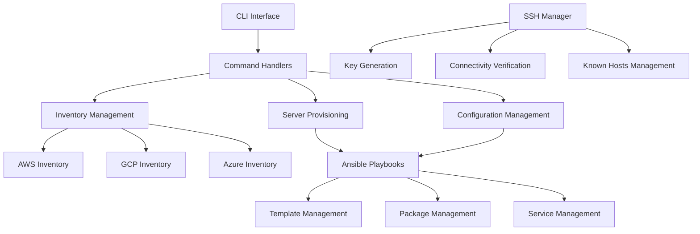

# Infrastructure Automation Tool

An infrastructure automation tool built with Python and Ansible for server provisioning and configuration management.

## Features

- Dynamic inventory generation for multiple cloud providers (AWS, GCP, Azure)
- Declarative server configuration using Ansible playbooks
- SSH key management and connectivity verification
- Modular design for easy extension
- Comprehensive logging and error handling
- Unit and integration testing support

## Architecture



## Prerequisites

- Python 3.9+
- Ansible 2.14+
- Cloud provider credentials (AWS/GCP/Azure)
- SSH key pair for server access

## Installation

1. Clone the repository:
```bash
git clone https://github.com/davyvg-dev/infrastructure-automation.git
cd infrastructure-automation
```

2. Create and activate a virtual environment:
```bash
python -m venv venv
source venv/bin/activate  # On Windows: venv\Scripts\activate
```

3. Install dependencies:
```bash
pip install -r requirements.txt
```

4. Configure cloud provider credentials:
```bash
# AWS
export AWS_ACCESS_KEY_ID=your_access_key
export AWS_SECRET_ACCESS_KEY=your_secret_key

# GCP
export GOOGLE_APPLICATION_CREDENTIALS=path/to/credentials.json

# Azure
export AZURE_SUBSCRIPTION_ID=your_subscription_id
export AZURE_TENANT_ID=your_tenant_id
export AZURE_CLIENT_ID=your_client_id
export AZURE_CLIENT_SECRET=your_client_secret
```

## Detailed Usage

### 1. Inventory Management

#### Generate AWS Inventory
```bash
python main.py inventory --provider aws --region us-west-2 --output inventories/aws.yml
```
Expected output:
```yaml
all:
  hosts:
    i-1234567890abcdef0:
      ansible_host: 54.0.0.1
      ansible_user: ubuntu
      instance_id: i-1234567890abcdef0
      instance_type: t2.micro
  children:
    webservers:
      hosts:
        i-1234567890abcdef0:
          ansible_host: 54.0.0.1
          ansible_user: ubuntu
          instance_id: i-1234567890abcdef0
          instance_type: t2.micro
```

#### Generate GCP Inventory
```bash
python main.py inventory --provider gcp --region us-central1 --output inventories/gcp.yml
```

#### Generate Azure Inventory
```bash
python main.py inventory --provider azure --region eastus --output inventories/azure.yml
```

### 2. Server Provisioning

#### Provision Web Servers
```bash
python main.py provision \
    --playbook src/playbooks/webserver.yml \
    --inventory inventories/aws.yml \
    --extra-vars "nginx_version=1.18.0 nginx_worker_processes=4"
```

The webserver playbook performs the following tasks:
1. Updates package cache
2. Installs required packages (nginx, python3, etc.)
3. Creates web root directory
4. Configures Nginx
5. Sets up default site configuration
6. Creates index.html
7. Configures firewall rules
8. Enables and starts Nginx service

### 3. Server Configuration

#### Configure Existing Servers
```bash
python main.py configure \
    --playbook src/playbooks/webserver.yml \
    --inventory inventories/aws.yml \
    --extra-vars "nginx_worker_connections=2048"
```

## SSH Key Management

The tool includes built-in SSH key management capabilities:

```python
from src.utils.ssh_manager import SSHManager

# Initialize SSH manager
manager = SSHManager()

# Generate new key pair
private_key, public_key = manager.generate_key_pair('my-key')

# Verify SSH connectivity
is_connected = manager.verify_connectivity(
    host='example.com',
    user='ubuntu',
    key_name='my-key'
)

# Add host to known_hosts
manager.add_to_known_hosts('example.com')
```

## Troubleshooting

### Common Issues and Solutions

1. **Inventory Generation Fails**
   - Check cloud provider credentials
   - Verify network connectivity
   - Ensure required permissions are set

2. **SSH Connection Issues**
   - Verify SSH key exists and has correct permissions (600)
   - Check if target host is reachable
   - Ensure security groups/firewall rules allow SSH access

3. **Ansible Playbook Failures**
   - Check playbook syntax: `ansible-playbook --syntax-check playbook.yml`
   - Verify inventory file format
   - Check for required variables

### Logging

The tool generates detailed logs in `infra_automation.log`. Log levels:
- INFO: Normal operations
- WARNING: Non-critical issues
- ERROR: Critical failures
- DEBUG: Detailed debugging information

## Testing

### Unit Tests
```bash
# Run all tests
pytest tests/

# Run specific test file
pytest tests/test_aws_inventory.py

# Run with coverage
pytest --cov=src tests/
```

### Integration Tests
```bash
# Run integration tests
pytest tests/integration/
```

## Project Structure

```
infrastructure-automation/
├── main.py                 # Main CLI entry point
├── requirements.txt        # Python dependencies
├── README.md              # Project documentation
├── src/
│   ├── inventory/         # Inventory management
│   │   └── aws_inventory.py
│   ├── playbooks/         # Ansible playbooks
│   │   ├── webserver.yml
│   │   └── templates/
│   │       ├── nginx.conf.j2
│   │       ├── default.conf.j2
│   │       └── index.html.j2
│   ├── providers/         # Cloud provider integrations
│   └── utils/             # Utility functions
│       └── ssh_manager.py
├── tests/                 # Test suite
│   ├── test_aws_inventory.py
│   └── test_ssh_manager.py
└── inventories/           # Generated inventory files
```
